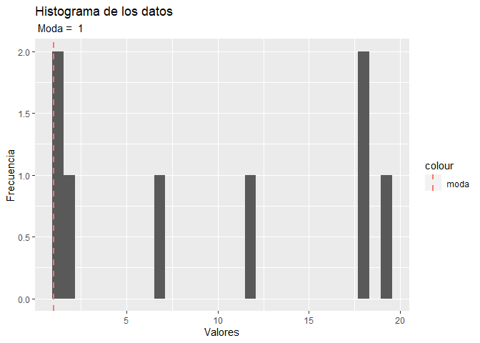
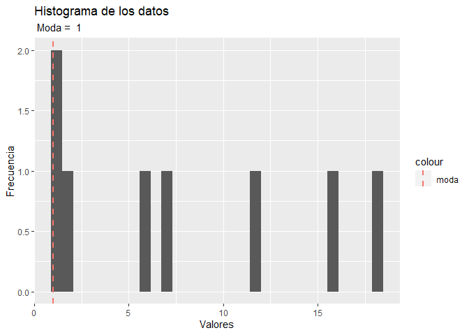
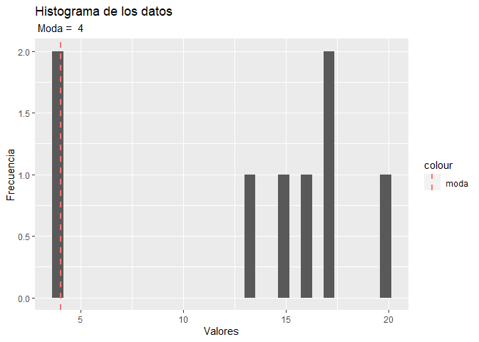
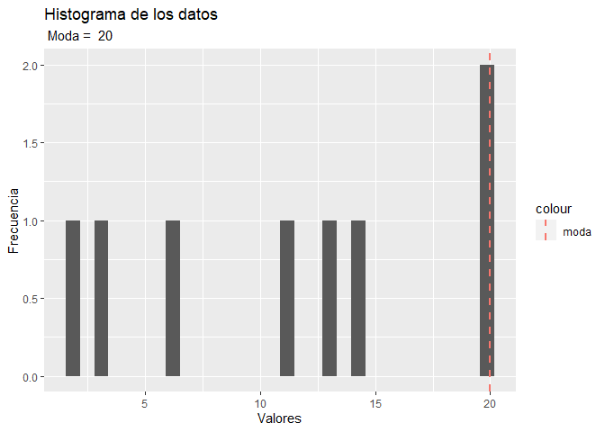

Lab 1
================
Lorena
2022-08-03

## Problema 1:

Unificación de datos en una tabla única.

``` r
head(data)
```

    ## # A tibble: 6 x 8
    ##   COD_VIAJE CLIENTE               UBICACION CANTIDAD PILOTO     Q CREDITO UNIDAD
    ##       <dbl> <chr>                     <dbl>    <dbl> <chr>  <dbl>   <dbl> <chr> 
    ## 1  10000001 EL PINCHE OBELISCO /~     76002     1200 Ferna~ 300        30 Camio~
    ## 2  10000002 TAQUERIA EL CHINITO ~     76002     1433 Hecto~ 358.       90 Camio~
    ## 3  10000003 TIENDA LA BENDICION ~     76002     1857 Pedro~ 464.       60 Camio~
    ## 4  10000004 TAQUERIA EL CHINITO       76002      339 Angel~  84.8      30 Panel 
    ## 5  10000005 CHICHARRONERIA EL RI~     76001     1644 Juan ~ 411        30 Camio~
    ## 6  10000006 UBIQUO LABS |||FALTA~     76001     1827 Luis ~ 457.       30 Camio~

``` r
filastablaunica
```

    ## [1] 2180

``` r
coltablaunica
```

    ## [1] 8

Incluyendo la nueva columna “FECHA”.

``` r
head(data)
```

    ##   COD_VIAJE                                       CLIENTE UBICACION CANTIDAD
    ## 1  10000001       EL PINCHE OBELISCO / Despacho a cliente     76002     1200
    ## 2  10000002               TAQUERIA EL CHINITO |||Faltante     76002     1433
    ## 3  10000003      TIENDA LA BENDICION / Despacho a cliente     76002     1857
    ## 4  10000004                           TAQUERIA EL CHINITO     76002      339
    ## 5  10000005 CHICHARRONERIA EL RICO COLESTEROL |||Faltante     76001     1644
    ## 6  10000006                       UBIQUO LABS |||FALTANTE     76001     1827
    ##                          PILOTO      Q CREDITO        UNIDAD   FECHA
    ## 1       Fernando Mariano Berrio 300.00      30 Camion Grande 01-2018
    ## 2        Hector Aragones Frutos 358.25      90 Camion Grande 01-2018
    ## 3          Pedro Alvarez Parejo 464.25      60 Camion Grande 01-2018
    ## 4          Angel Valdez Alegria  84.75      30         Panel 01-2018
    ## 5 Juan Francisco Portillo Gomez 411.00      30 Camion Grande 01-2018
    ## 6             Luis Jaime Urbano 456.75      30 Camion Grande 01-2018

``` r
filastablaunica
```

    ## [1] 2180

``` r
coltablaunica
```

    ## [1] 9

Exportando el archivo “entregable.xlsx” con los resultado de la tabla
“data”.

``` r
write_xlsx(data2, "entregable.xlsx")
entregable <- readxl::read_excel("entregable.xlsx")
head(entregable)
```

    ## # A tibble: 6 x 9
    ##   COD_VIAJE CLIENTE         UBICACION CANTIDAD PILOTO     Q CREDITO UNIDAD FECHA
    ##       <dbl> <chr>               <dbl>    <dbl> <chr>  <dbl>   <dbl> <chr>  <chr>
    ## 1  10000001 EL PINCHE OBEL~     76002     1200 Ferna~ 300        30 Camio~ 01-2~
    ## 2  10000002 TAQUERIA EL CH~     76002     1433 Hecto~ 358.       90 Camio~ 01-2~
    ## 3  10000003 TIENDA LA BEND~     76002     1857 Pedro~ 464.       60 Camio~ 01-2~
    ## 4  10000004 TAQUERIA EL CH~     76002      339 Angel~  84.8      30 Panel  01-2~
    ## 5  10000005 CHICHARRONERIA~     76001     1644 Juan ~ 411        30 Camio~ 01-2~
    ## 6  10000006 UBIQUO LABS ||~     76001     1827 Luis ~ 457.       30 Camio~ 01-2~

## Problema 2:

Moda de vectores.

``` r
vlista
```

    ## [[1]]
    ##    a
    ## 1 19
    ## 2  1
    ## 3  7
    ## 4 18
    ## 5 12
    ## 6  2
    ## 7 18
    ## 8  1
    ## 
    ## [[2]]
    ##    a
    ## 1  1
    ## 2 12
    ## 3  7
    ## 4  6
    ## 5 18
    ## 6 16
    ## 7  1
    ## 8  2
    ## 
    ## [[3]]
    ##    a
    ## 1 17
    ## 2 17
    ## 3 20
    ## 4 13
    ## 5 16
    ## 6  4
    ## 7  4
    ## 8 15
    ## 
    ## [[4]]
    ##    a
    ## 1 20
    ## 2 14
    ## 3  3
    ## 4 13
    ## 5 20
    ## 6  2
    ## 7  6
    ## 8 11

Moda del vector “vlista\[1\]”

``` r
vlista[1]
```

    ## [[1]]
    ##    a
    ## 1 19
    ## 2  1
    ## 3  7
    ## 4 18
    ## 5 12
    ## 6  2
    ## 7 18
    ## 8  1

<!-- -->

Moda del vector “vlista\[2\]”

``` r
vlista[2]
```

    ## [[1]]
    ##    a
    ## 1  1
    ## 2 12
    ## 3  7
    ## 4  6
    ## 5 18
    ## 6 16
    ## 7  1
    ## 8  2

<!-- -->

Moda del vector “vlista\[3\]”

``` r
vlista[3]
```

    ## [[1]]
    ##    a
    ## 1 17
    ## 2 17
    ## 3 20
    ## 4 13
    ## 5 16
    ## 6  4
    ## 7  4
    ## 8 15

<!-- -->

Moda del vector “vlista\[4\]”

``` r
vlista[4]
```

    ## [[1]]
    ##    a
    ## 1 20
    ## 2 14
    ## 3  3
    ## 4 13
    ## 5 20
    ## 6  2
    ## 7  6
    ## 8 11

<!-- -->

## Problema 3:

Lectura del archivo del portal SAT sobre el Parque Vehicular de Enero
2019.

``` r
sat <- read_delim("Informacion_para_analisis_estadistico_vehiculos_2019_enero/INE_PARQUE_VEHICULAR_080219.txt", delim="|")
```

    ## New names:
    ## * `` -> `...11`

    ## Warning: One or more parsing issues, see `problems()` for details

    ## Rows: 2435294 Columns: 11
    ## -- Column specification --------------------------------------------------------
    ## Delimiter: "|"
    ## chr (8): MES, NOMBRE_DEPARTAMENTO, NOMBRE_MUNICIPIO, MODELO_VEHICULO, LINEA_...
    ## dbl (2): ANIO_ALZA, CANTIDAD
    ## lgl (1): ...11
    ## 
    ## i Use `spec()` to retrieve the full column specification for this data.
    ## i Specify the column types or set `show_col_types = FALSE` to quiet this message.

``` r
head(sat)
```

    ## # A tibble: 6 x 11
    ##   ANIO_ALZA MES   NOMBRE_DEPARTAMENTO NOMBRE_MUNICIPIO MODELO_VEHICULO
    ##       <dbl> <chr> <chr>               <chr>            <chr>          
    ## 1      2007 05    HUEHUETENANGO       "HUEHUETENANGO"  2007           
    ## 2      2007 05    EL PROGRESO         "EL JICARO"      2007           
    ## 3      2007 05    SAN MARCOS          "OCOS"           2007           
    ## 4      2007 05    ESCUINTLA           "SAN JOS\xc9"    2006           
    ## 5      2007 05    JUTIAPA             "MOYUTA"         2007           
    ## 6      2007 05    GUATEMALA           "FRAIJANES"      1997           
    ## # ... with 6 more variables: LINEA_VEHICULO <chr>, TIPO_VEHICULO <chr>,
    ## #   USO_VEHICULO <chr>, MARCA_VEHICULO <chr>, CANTIDAD <dbl>, ...11 <lgl>

## Including Plots

You can also embed plots, for example:

<!-- -->

Note that the `echo = FALSE` parameter was added to the code chunk to
prevent printing of the R code that generated the plot.
