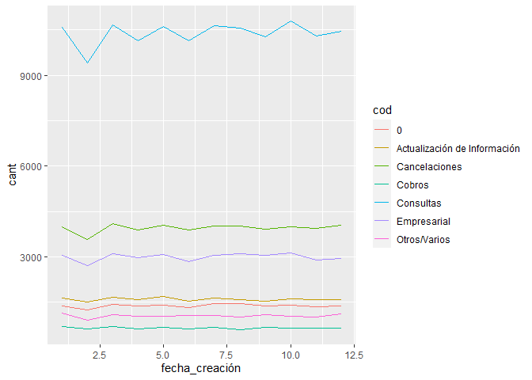
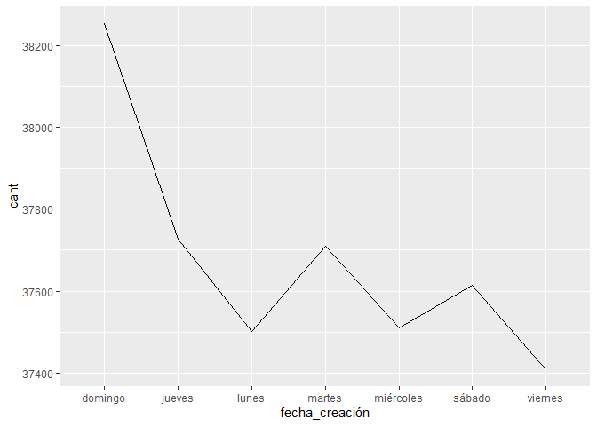
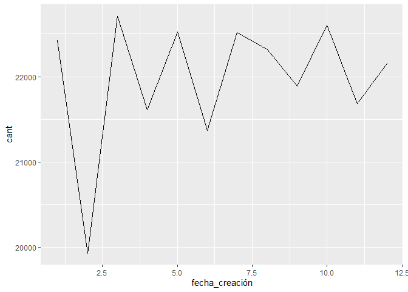
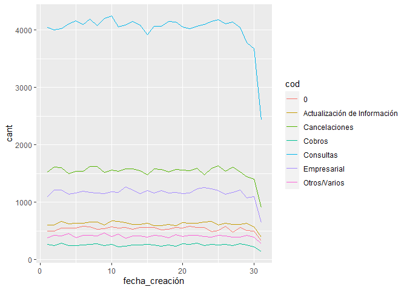

Laboratorio 5
================
Lorena 20200396

### Problema 1:

#### Predecir un eclipse solar

En tiempo de Norte América, el eclipse total inició el 21 de agosto del
2017 a las 18:26:40.

Este mismo evento, sucederá un Saros después.

Para predecir el siguiente eclipse solar, se consideró la siguiente
información:

Fecha del eclipse histórico:

``` r
e_total
```

    ## [1] "2017-08-21 18:26:40 EST"

Un synodic month es igual a:

``` r
synodic_m
```

    ## [1] "29d 12H 44M 3S"

Un saros es igual a:

``` r
saroc
```

    ## [1] "6467d 2676H 9812M 669S"

Por lo tanto, la fecha del siguiente eclipse solar es

``` r
s_eclipe
```

    ## [1] "2035-09-02 02:09:49 EST"

### Parte 2:

#### Agrupaciones y operaciones con fechas

Información considerada:

    ## # A tibble: 6 × 9
    ##   fecha_creación hora_creación       caller_id cod     email   sms  call fecha…¹
    ##   <chr>          <dttm>                  <dbl> <chr>   <dbl> <dbl> <dbl> <chr>  
    ## 1 43020          1899-12-31 22:18:36    368224 Cancel…     0     1     0 43020  
    ## 2 19-03-17       1899-12-31 17:35:32    368224 Otros/…     0     1     0 19-03-…
    ## 3 13-03-17       1899-12-31 22:03:45    368224 Consul…     0     1     0 13-03-…
    ## 4 14-04-17       1899-12-31 17:55:33    368224 Consul…     0     1     0 14-04-…
    ## 5 43043          1899-12-31 09:08:42    748633 Consul…     0     1     0 43043  
    ## 6 29-04-17       1899-12-31 07:19:37    599434 Cancel…     0     1     0 29-04-…
    ## # … with 1 more variable: hora_final <dttm>, and abbreviated variable name
    ## #   ¹​fecha_final

1.  ¿En qué meses existe una mayor cantidad de llamadas por código?

Ocupación de llamadas por código durante el año.

Para las llamadas sin categoría es julio, para llamada por actualización
de información es mayo, para cancelaciones es marzo, para cobros y otros
asuntos es enero y para consultas y de tipo empresarial es octubre.

<!-- -->

Meses con mayor cantidad de llamadas por código.

    ## # A tibble: 7 × 3
    ## # Groups:   fecha_creación [5]
    ##   fecha_creación cod                           cant
    ##            <dbl> <chr>                        <int>
    ## 1              7 0                             1463
    ## 2              5 Actualización de Información  1691
    ## 3              3 Cancelaciones                 4092
    ## 4              1 Cobros                         688
    ## 5             10 Consultas                    10790
    ## 6             10 Empresarial                   3136
    ## 7              1 Otros/Varios                  1129

2.  ¿Qué día de la semana es el más ocupado?

Los días más ocupados son los fines de semana, especialmente el domingo
que recibe 500 llamadas más a diferencia del resto de la semana.

    ## # A tibble: 7 × 2
    ##   fecha_creación  cant
    ##   <chr>          <int>
    ## 1 domingo        38254
    ## 2 jueves         37726
    ## 3 lunes          37501
    ## 4 martes         37710
    ## 5 miércoles      37511
    ## 6 sábado         37614
    ## 7 viernes        37409

En la gráfica se observa claramente que domingo son los días más
ocupados, viernes son los días que menos llamadas se reciben.

<!-- -->

3.  ¿Qué mes es el más ocupado?

El mes más ocupado es marzo con un total de 22708 llamadas.El mes que
menos llamadas registra es febrero.

    ## # A tibble: 12 × 2
    ##    fecha_creación  cant
    ##             <dbl> <int>
    ##  1              1 22425
    ##  2              2 19932
    ##  3              3 22708
    ##  4              4 21611
    ##  5              5 22525
    ##  6              6 21370
    ##  7              7 22514
    ##  8              8 22316
    ##  9              9 21891
    ## 10             10 22601
    ## 11             11 21681
    ## 12             12 22151

    ## # A tibble: 1 × 2
    ##   fecha_creación  cant
    ##            <dbl> <int>
    ## 1              3 22708

<!-- -->

4.  ¿Existe una concentración o estacionalidad en la cantidad de
    llamadas?

Para el mes de febrero existe poca demanda, en marzo se encuentra cierta
concentración de llamadas al igual que en octubre. Para los meses de
junio, julio y agosto se observa cierta estacionalidad.

    ## # A tibble: 84 × 3
    ## # Groups:   fecha_creación [12]
    ##    fecha_creación cod                           cant
    ##             <dbl> <chr>                        <int>
    ##  1              1 0                             1361
    ##  2              1 Actualización de Información  1627
    ##  3              1 Cancelaciones                 3979
    ##  4              1 Cobros                         688
    ##  5              1 Consultas                    10592
    ##  6              1 Empresarial                   3049
    ##  7              1 Otros/Varios                  1129
    ##  8              2 0                             1236
    ##  9              2 Actualización de Información  1493
    ## 10              2 Cancelaciones                 3572
    ## # … with 74 more rows

<!-- -->

Los días 10 y 7 son los más ocupados durante el mes. A fin de mes se
registro una menor cantidad de llamadas. Existe cierta concentración en
los primero 10 días del mes y una decaida durante los últimos 5 días.

    ## # A tibble: 217 × 3
    ## # Groups:   fecha_creación [31]
    ##    fecha_creación cod                           cant
    ##             <int> <chr>                        <int>
    ##  1              1 0                              495
    ##  2              1 Actualización de Información   596
    ##  3              1 Cancelaciones                 1527
    ##  4              1 Cobros                         268
    ##  5              1 Consultas                     4041
    ##  6              1 Empresarial                   1099
    ##  7              1 Otros/Varios                   384
    ##  8              2 0                              498
    ##  9              2 Actualización de Información   604
    ## 10              2 Cancelaciones                 1606
    ## # … with 207 more rows

<!-- -->

5.  ¿Cuántos minutos dura la llamada promedio?

Las llamadas duran un máximo de 30 minutos en total, por lo que el
promedio de minutos de duración es alrededor de 15 minutos.

    ## Time difference of 14.88962 mins

6.  Tabla de frecuencias con el tiempo de llamada.

<!-- -->

    ##    Tiempo de llamada en minutos Cantidad de llamadas
    ## 1                             0                 9706
    ## 2                             1                 8741
    ## 3                             2                 8508
    ## 4                             3                 8445
    ## 5                             4                 8513
    ## 6                             5                 8413
    ## 7                             6                 8501
    ## 8                             7                 8420
    ## 9                             8                 8576
    ## 10                            9                 8504
    ## 11                           10                 8481
    ## 12                           11                 8388
    ## 13                           12                 8462
    ## 14                           13                 8614
    ## 15                           14                 8462
    ## 16                           15                 8445
    ## 17                           16                 8464
    ## 18                           17                 8576
    ## 19                           18                 8451
    ## 20                           19                 8331
    ## 21                           20                 8578
    ## 22                           21                 8288
    ## 23                           22                 8414
    ## 24                           23                 8630
    ## 25                           24                 8465
    ## 26                           25                 8346
    ## 27                           26                 8417
    ## 28                           27                 8431
    ## 29                           28                 8299
    ## 30                           29                 8452
    ## 31                           30                 8404

### Parte 3:

#### Signo Zodiacal

Tabla que delimita las fechas de los signos zodiacales.

    ##          signo d_inicio m_inicio d_final m_final
    ## 1        aries       21        3      20       4
    ## 2        tauro       21        4      20       5
    ## 3      geminis       21        5      20       6
    ## 4       cancer       22        6      21       7
    ## 5          leo       22        7      21       8
    ## 6        virgo       24        8      23       9
    ## 7        libra       24        9      23      10
    ## 8     escorpio       24       10      23      11
    ## 9    sagitario       23       11      22      12
    ## 10 capricornio       22       12      21       1
    ## 11     acuario       21        1      20       2
    ## 12      piscis       20        2      19       3

Lectura de la fecha de nacimiento, formato preferible (15 enero 2000).

``` r
fecha_nac <- dmy(readline())
```

``` r
# ejemplo 
# fecha_nac <- dmy("15 enero 2000)
```

    ## [1] "2000-01-15"

El signo identificado para la fecha de nacimiento dada es:

    ## [1] "capricornio"

### Parte 4:

#### Flights

Data utilizada: Flights.

dep_time, arr_time, sched_dep_time,sched_arr_time son variables que
representan la hora de salida de los aviones. Sin embargo, están en
formato numérico. Es decir, si una de las observaciones tiene 845 en
sched_dep_time y 932 en sched_arr_time significa que tenia como hora de
salida las 8:45 y llegada las 9:32.

1.  4 nuevas columnas para cada variable descrita anteriormente con
    formato de fecha y hora.

<!-- -->

    ##   dep_time arr_time sched_dep_time sched_arr_time          f_dep_time
    ## 1      517      830            515            819 2013-01-01 05:17:00
    ## 2      533      850            529            830 2013-01-01 05:33:00
    ## 3      542      923            540            850 2013-01-01 05:42:00
    ## 4      544     1004            545           1022 2013-01-01 05:44:00
    ## 5      554      812            600            837 2013-01-01 05:54:00
    ## 6      554      740            558            728 2013-01-01 05:54:00
    ##            f_arr_time        f_sched_time    f_sched_arr_time
    ## 1 2013-01-01 08:30:00 2013-01-01 05:15:00 2013-01-01 08:19:00
    ## 2 2013-01-01 08:50:00 2013-01-01 05:29:00 2013-01-01 08:30:00
    ## 3 2013-01-01 09:23:00 2013-01-01 05:40:00 2013-01-01 08:50:00
    ## 4 2013-01-01 10:04:00 2013-01-01 05:45:00 2013-01-01 10:22:00
    ## 5 2013-01-01 08:12:00 2013-01-01 06:00:00 2013-01-01 08:37:00
    ## 6 2013-01-01 07:40:00 2013-01-01 05:58:00 2013-01-01 07:28:00

2.  Delay total que existe en cada vuelo. El delay total se encuentra
    sumando el delay de la salida y el delay de la entrada del vuelo.

<!-- -->

    ##   delay_tot
    ## 1   13 mins
    ## 2   24 mins
    ## 3   35 mins
    ## 4  -19 mins
    ## 5  -31 mins
    ## 6    8 mins
